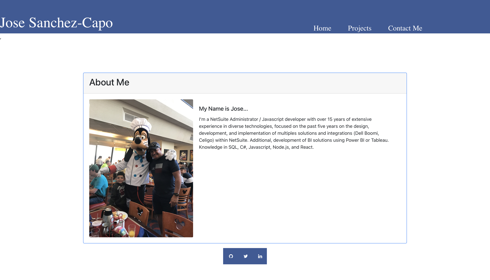

# React Portfolio - By Jose Sanchez-Capo

Description:

The repository contains the Portfolio with Projects using React

Repository name: https://github.com/josesanchezcapo/my_portfolio

The live page can be accessed via the following  url:
https://josesanchezcapo-portfolio.herokuapp.com

Screecaps:

In Safari:

## My Task

Responsive design ensures that web applications render well on a variety of devices and window or screen sizes. As a developer, you will likely be asked to create a mobile-first application or add responsive design to an existing application.

